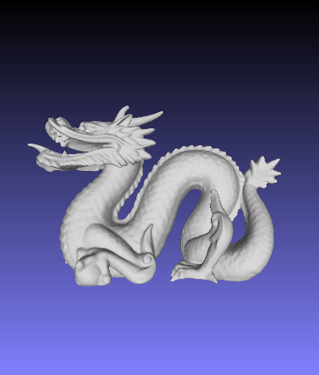
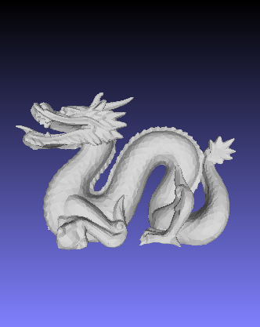
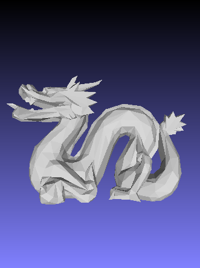

# 计算机图形学基础实验报告 网格简化

计45 孟垂正 2013010952

[TOC]

## 二次误差网格简化

使用二次误差方法对所有相邻节点组成的节点对计算误差, 逐个选取最小者求解线性方程组并更新堆中相关元素. 二次误差计算方法详见课件.

## 实现细节

- 方程组出现奇异解情况的处理. 方程组无解或出现无穷多解时, 采用伪逆方法求解.
- 边界保持. 合并时判断合并节点对的节点是否在边界上. 如果二者均不在边界上, 则进行合并, 否则不进行合并. 判断节点是否在边界的方法: 统计节点的所在面中与节点关联的边的数量, 若每条边均出现2次, 则节点不在边界上, 否则在边界上.

## 简化效果

以fixed.perfect.dragon.100K.0.07.obj模型为例进行简化, 简化比例为0.05和0.01. 对应的模型文件分别为fixed.perfect.dragon.100K.0.07.obj, dragon005.obj, dragon001.obj.

| 简化比 | 正面图 |
|------- |------|
|1(未简化)|  |
|0.05|  |
|0.01|  |